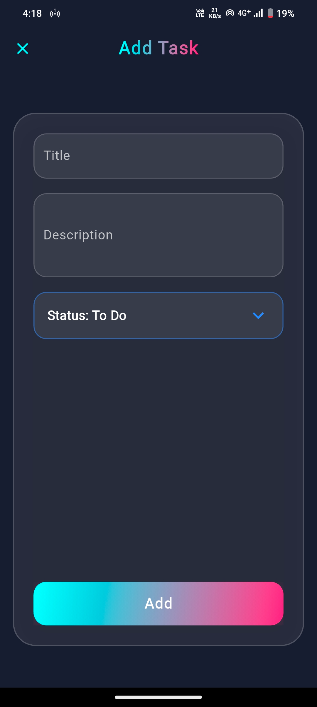

<h1 align="center">ALPHATASK</h1>

<p align="center"><em>Empower your productivity, streamline your task management.</em></p>

<p align="center">
  
  
  
</p>

<p align="center"><em>Built with the tools and technologies:</em></p>

<p align="center">
  
  
  
  
  
  
  
  
  
  
  
  
  
</p>

---

## 🛠️ **Built With**

<p>
  
  
  
  
  
  
  
  
</p>

---

## 📑 **Table of Contents**
- [Overview](#overview)
- [Features](#features)
- [Getting Started](#getting-started)
- [Prerequisites](#prerequisites)
- [Installation](#installation)
- [Usage](#usage)
- [Testing](#testing)
- [Screenshots](#screenshots)
- [License](#license)

---

## 📝 **Overview**
AlphaTask is a modern, offline-first task management app with built-in AI sentiment analysis. Designed for productivity enthusiasts and developers, it leverages Flutter, SQLite, and TensorFlow Lite to deliver a seamless, cross-platform experience with a futuristic, glassmorphism-inspired UI.

---

## ✨ **Features**
- 📝 **Task Management:** Add, edit, delete, and organize your tasks offline.
- 🔄 **Offline/Online Sync:** Seamless sync with conflict resolution (last write wins).
- 🤖 **AI Sentiment Analysis:** Analyze task descriptions for positive, negative, or neutral sentiment using TensorFlow Lite.
- 🎨 **Futuristic UI:** Glassmorphism, animations, and modern design.
- 📊 **Status & Sentiment Visualization:** Color-coded chips and animated status selectors.
- 🗃️ **Local Storage:** All data stored securely on your device using SQLite.
- 🚀 **Fast & Lightweight:** Optimized for performance and minimal app size.

---

## 🚦 **Getting Started**

### Prerequisites
- [Flutter SDK](https://flutter.dev/docs/get-started/install)
- Dart 3+
- Android Studio or VS Code (recommended)
- Android/iOS device or emulator

---

## ⚡ **Installation**

1. **Clone the repository:**
   ```sh
   git clone https://github.com/CodeGovindz/AlphaTask.git
   cd AlphaTask
   ```
2. **Install dependencies:**
   ```sh
   flutter pub get
   ```
3. **Run the app:**
   ```sh
   flutter run
   ```
4. **Build release APK:**
   ```sh
   flutter build apk --release
   ```

---

## 🚀 **Usage**
- Add, edit, and delete tasks from the main screen.
- Toggle online/offline mode and sync tasks.
- View sentiment analysis for each task (color-coded).
- Enjoy a modern, animated UI experience.

---

## 🧪 **Testing**
- Run all tests:
  ```sh
  flutter test
  ```
- Test offline/online sync and sentiment analysis in the app.

---

## 🖼️ **Screenshots**
<!-- Add screenshots here when available -->
<p align="center">
  
  
  
</p>

---

## 📄 **License**

This project is licensed under the MIT License. See the [LICENSE](LICENSE) file for details.

---

<p align="center">
  <b>Empower your productivity with AlphaTask!</b>
</p>
